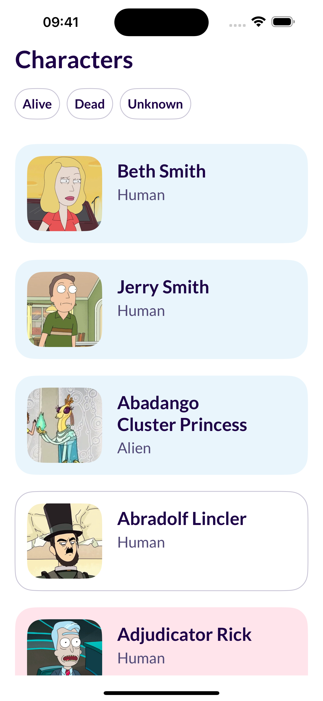
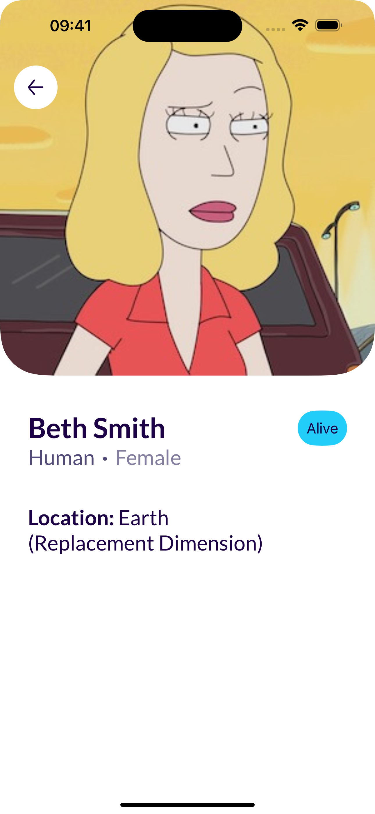
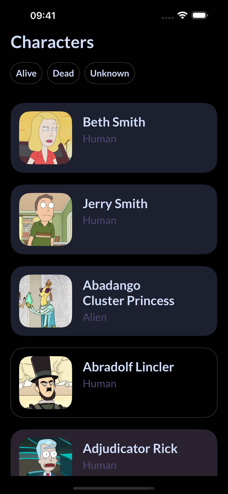
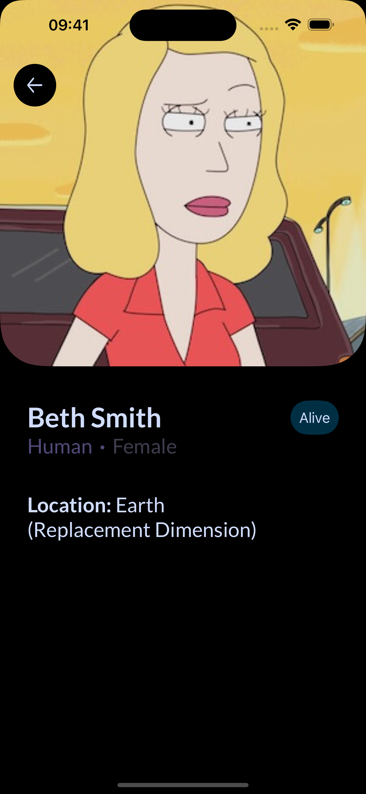

# DashDevs. Assignment

## Project Description
Create an iOS application that fetches data from the [Rick and Morty API](https://rickandmortyapi.com/documentation/#introduction) and displays a list of characters in a paginated manner, showing 20 characters per page.

## Requirements
### Screen #1: Character List
- [x] Display a list of loaded characters, with pagination (load 20 characters at a time)
- [x] Each list item should include:
  - [x] Name
  - [x] Image
  - [x] Species
- [x] Implement filtering functionality to allow users to filter the list by character status (alive, dead, unknown)

### Screen #2: Character Details
- [x] Provide a detailed view of a selected character, displaying the following information:
  - [x] Name
  - [x] Image
  - [x] Species
  - [x] Status
  - [x] Gender
  - [x] Location

## Demonstration

  
  
  
  

## Prerequisites
- Xcode 15+: I'm using `ASSETCATALOG_COMPILER_GENERATE_ASSET_SYMBOLS` setting
- iOS 16+: as far as I know that's a common practice to support the last two versions of iOS (unless otherwise stated)
- [!] Tests should be run on a simulator only because of snapshots and the project should NOT be located on iCloud (otherwise you will have to record snapshot tests first and then assert them)

## Developer's notes

### API
- API layer contains main `HTTPClient` protocol which I'm utilizing in the composition root (`SceneDelegate`)
- The main network class is `URLSessionHTTPClient` which is a concrete implementation of the `HTTPClient`
- I split each endpoint into two components: a request and a mapper (this way, I aimed to adhere to the `SRP` (Single Responsibility Principle)). The endpoints are:
  - Get All Characters (20 per page)
  - Get Image for the Character

### Architecture
- I was trying to accomplish this task using `Dependency Injection` as the best pattern in my opinion and cover concrete implementations with appropriate protocols
- **Why `MVVM`?** Because I like the idea that a ViewModel knows nothing about a View. It just delegates the completions or changes to whoever is subscribed to it
- **Why not `MVC`, `MVP` or something else?**. In case of `MVC`, a ViewController would know too much about how to handle everything. `MVP` could be a valid choice, but I don't like too many new classes and delegates just to communicate between a View and a Presenter. `VIPER`+ would be too much for this simple application
- **Navigation**. To decouple the `CharacterListViewController` from any specific detail view controller, I decided to create the `onSelect` closure and delegate this responsibility to the composition root

### Persistence
- Contains `ImageCache` protocol
- In this application I've implemented the `ImageCache` protocol using the `NSCache` class which is called `InMemoryImageCache` for storing cache in memory. Maybe that's not the best decision, but I limited it to 100MB
- Implementing, for example, `FileManagerImageCache` to store the cache in short or long-term memory storage would be straightforward

### Presentation
- The character list is made using `UIKit` without storyboards. However, I don't mind to use them. Depends on a team's preferences
- Filter buttons, cells of the list and the detail screen is made using `SwiftUI`
- Interfacing between `UIKit` and `SwiftUI` located primarily in `SceneDelegate` and `CharacterListViewController`
- In this project I don't pay any attention to the error handling on UI. However, it wouldn't be much effort to fulfill UI with it if there is such a task

### About the project, challenges and what I would change
- Pagination works specifically for not filtered array (all filters active)
- `SceneDelegate` is a composition root. Here I inject all of the dependencies
- Support both light and dark theme
- `CharacterStatus` is an enum which represents the server's status, but it also contains some UI logic
- I had to use `UINavigationController: UIGestureRecognizerDelegate` extension to make swipe back from the detail view
- I couldn't recognise the font that you use in these layouts and faced the issue when you have to change a font for the whole application for the first time
- Updating `SwiftUI` view (`CharacterListFilterButtonView`\`s) active state from `UIKit` `CharacterListViewController`
- Because of lack of time (I aimed to complete within two days):
  - I have written some tests, but because of lack of time I haven't covered the whole project
  - I haven't implemented any sort of localization
  - `CharacterListCellViewModel` contains even data that it doesn't need (`gender` and `location`) - only the child needs it. This separation could be done by making a request from the child view `CharacterDetailsView` to retrive this data from the server

### Bugs
> **Note.**
> I want to mention that I've discovered at least one bug that I couldn't fix quickly. If scroll very quickly it can crash
